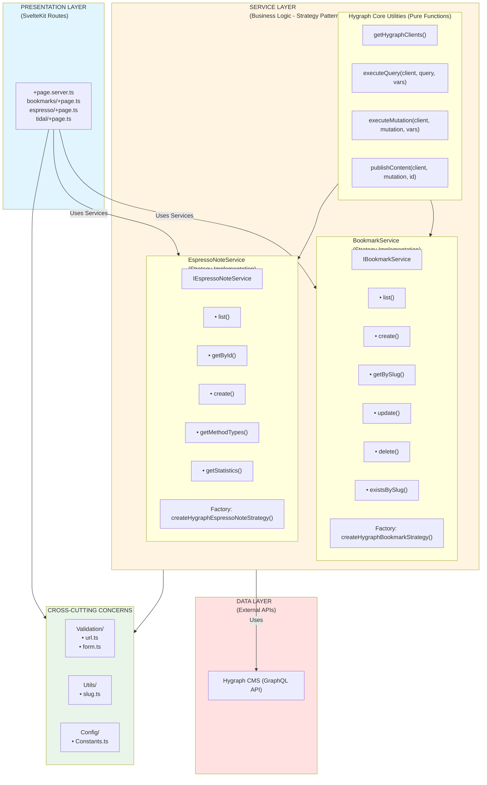
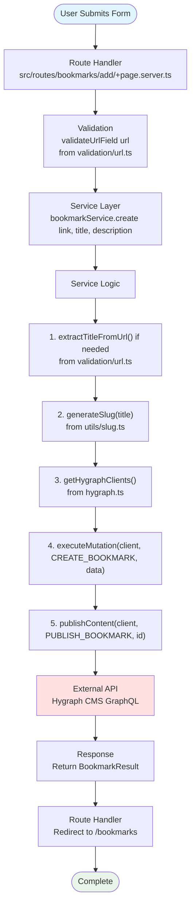
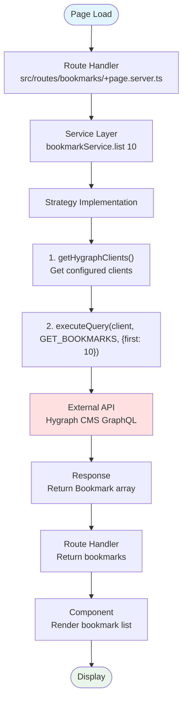
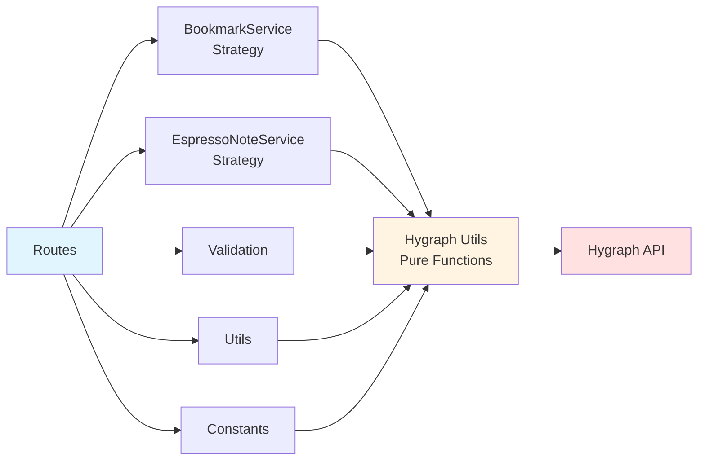
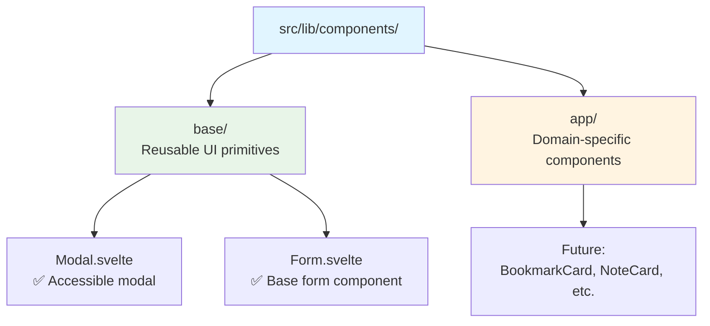
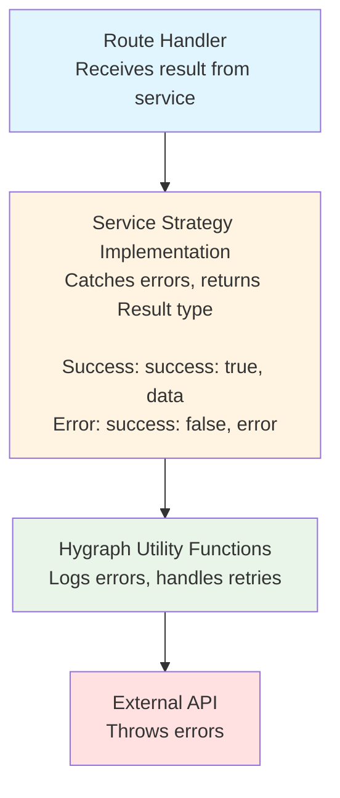
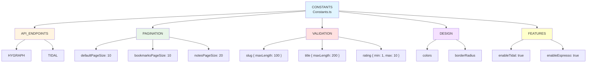
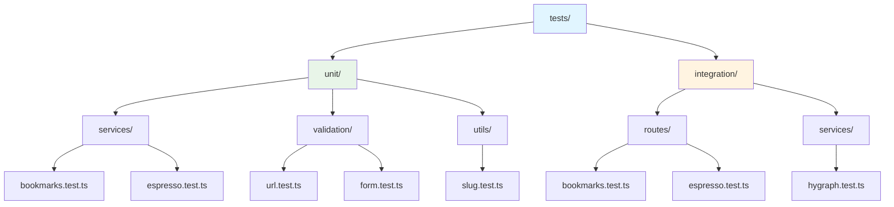
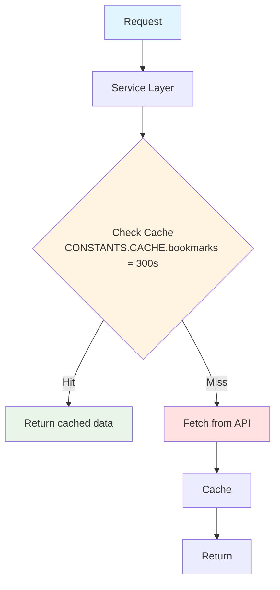

# Architecture Overview

## Layer Diagram



## Request Flow

### Creating a Bookmark



### Fetching Bookmarks



## Dependency Graph



## Component Organization



## Service Exports

```typescript
// src/lib/services/index.ts (Central export)

// Core utilities (pure functions)
export {
  getHygraphClients,
  executeQuery,
  executeMutation,
  publishContent
} from './api/hygraph';

// Strategy implementations and interfaces
export {
  createHygraphBookmarkStrategy,
  bookmarkService
} from './api/bookmarks';
export type { IBookmarkService } from './api/bookmarks';

export {
  createHygraphEspressoNoteStrategy,
  espressoNoteService
} from './api/espresso';
export type { IEspressoNoteService } from './api/espresso';

// Utilities
export * from './utils/slug';
export * from './validation/url';
export * from './validation/form';

// Types
export type { CreateBookmarkInput, BookmarkResult } from './api/bookmarks';
export type { CreateEspressoNoteInput, EspressoNoteResult } from './api/espresso';
```

## Usage Pattern

### In Route Handlers

```typescript
// ❌ OLD WAY (Direct API calls)
import { getHygraphClient, GET_BOOKMARKS } from '$lib';

try {
    const client = getHygraphClient();
    const data = await client.request<{ bookmarks: Bookmark[] }>(GET_BOOKMARKS);
    return { bookmarks: data.bookmarks };
} catch {
    return { bookmarks: [] };
}

// ✅ NEW WAY (Service layer)
import { bookmarkService } from '$lib/services';

const bookmarks = await bookmarkService.list(10);
return { bookmarks };
```

### Benefits
1. **Cleaner**: 8 lines → 2 lines
2. **DRY**: Reusable across all routes
3. **Testable**: Easy to mock services
4. **Type-safe**: Full TypeScript support
5. **Maintainable**: Change once, update everywhere

## Error Handling Strategy



## Type Safety Flow

```typescript
// Input Type
CreateBookmarkInput
    ↓
// Service Method
bookmarkService.create(input)
    ↓
// Result Type
BookmarkResult<Bookmark>
    ↓
// Route Handler
{ success: boolean; data?: Bookmark; error?: string }
    ↓
// Component
PageData { bookmarks: Bookmark[] }
```

## Configuration Hierarchy



## Testing Structure



## Performance Optimization

### Caching Strategy (Future)



### Pagination Strategy
```typescript
// Configurable through Constants
CONSTANTS.PAGINATION.bookmarksPageSize = 10;

// Used in services
async list(limit = CONSTANTS.PAGINATION.bookmarksPageSize)
```

## Extensibility

### Adding New Service (Strategy Pattern)

1. Create service file:
```typescript
// src/lib/services/api/my-service.ts
import { getHygraphClients, executeQuery, executeMutation } from './hygraph';

// Define the service interface
export interface IMyService {
    myMethod(): Promise<MyData[]>;
}

// Create strategy factory
export const createHygraphMyServiceStrategy = (): IMyService => {
    const { client, mutationClient } = getHygraphClients();

    return {
        myMethod: async (): Promise<MyData[]> => {
            const data = await executeQuery<{ myData: MyData[] }>(
                client,
                MY_QUERY,
                {},
                'Fetch my data'
            );
            return data?.myData || [];
        }
    };
};

// Export singleton instance
export const myService: IMyService = createHygraphMyServiceStrategy();
```

2. Export from index:
```typescript
// src/lib/services/index.ts
export { createHygraphMyServiceStrategy, myService } from './api/my-service';
export type { IMyService } from './api/my-service';
```

3. Use in routes:
```typescript
import { myService } from '$lib/services';
const data = await myService.myMethod();
```

4. Can easily swap implementations:
```typescript
// For testing: create mock strategy
const createMockMyServiceStrategy = (): IMyService => ({
    myMethod: async () => [/* mock data */]
});

// For REST API: create REST strategy
const createRestMyServiceStrategy = (): IMyService => ({
    myMethod: async () => {
        const response = await fetch('/api/my-data');
        return response.json();
    }
});
```

## Key Benefits

✅ **Strategy Pattern**: Easy to swap implementations (GraphQL ↔ REST ↔ Mock)
✅ **SOLID Compliance**: Single responsibility with dependency injection
✅ **DRY**: No duplicate code across routes
✅ **Type Safety**: Full TypeScript coverage with interfaces
✅ **Testable**: Pure functions and strategies easy to mock
✅ **Maintainable**: Change once, update everywhere
✅ **Extensible**: Add new strategies without modifying existing code
✅ **No Inheritance**: Composition over inheritance
✅ **Documented**: JSDoc comments throughout
✅ **Consistent**: All routes follow same pattern
